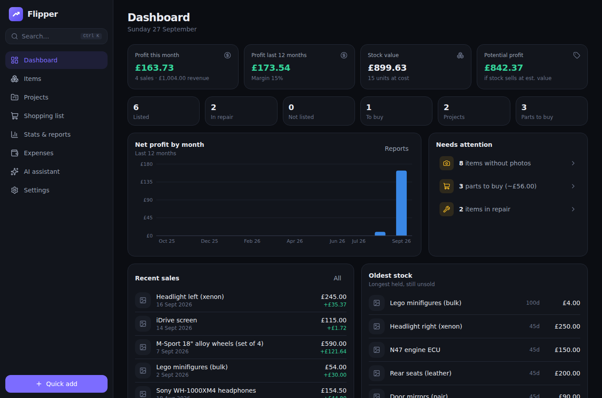
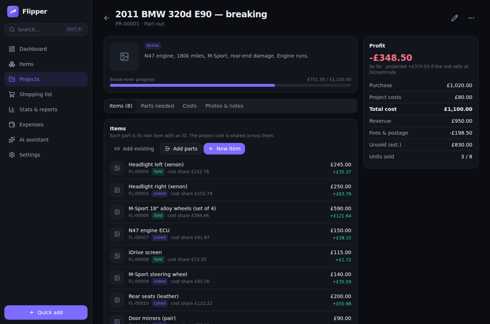
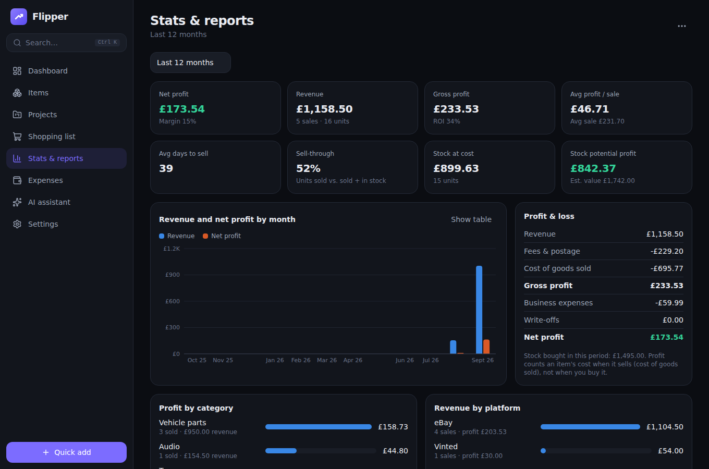
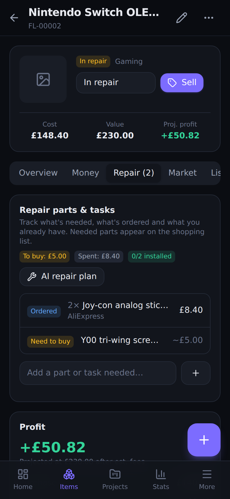

# Flipper

Inventory, project and profit tracking for flippers and resellers — with an AI assistant for research, pricing, part-outs, repair shopping lists and listing copy.

Works on phone and desktop, installs like an app, works offline, and keeps your data on your device (optional Google Drive sync).



| Part-out project                         | Reports                                  | Phone                                      |
| ---------------------------------------- | ---------------------------------------- | ------------------------------------------ |
|  |  |  |

## Features

**Inventory**

- Items with photos (camera or gallery), automatic human-readable IDs (`FL-00042`), status, condition, quantity, storage location, tags, barcode/serial.
- Lifecycle tabs: **Active / Finished / Archived / All**. Statuses: to buy, in stock, in repair, listed, sold, parted out, kept, used as part, written off.
- Search everything (`Ctrl K` or `/`), filter by status/category/project, sort by value, profit, cost, age…, compact or comfortable density, list or grid view, bulk actions.
- Printable **QR labels** — scanning one with any phone camera opens the item.

**Projects**

- Types: flip, **part-out / breaking**, **repair**, restoration, bundle/lot, other.
- Project costs are shared across its items automatically (by value, equally, or manually), so every part in a part-out shows its own profit.
- Break-even progress, projected profit, budget and target tracking.
- **Parts needed**: track repair parts as need-to-buy / ordered / have / installed, reuse parts from your own stock, and see everything to buy on the **Shopping list**.

**Money**

- Record sales with platform fees (auto-estimated from your fee table), postage and buyer-paid shipping.
- Cost basis = purchase + extra costs + repair parts + share of project costs. Realized and projected profit, margin, ROI, days to sell.
- **Stats & reports**: P&L (cost-of-goods-sold basis), monthly revenue/profit chart with table view, profit by category / platform / project type, best and worst items, sell-through, stock value, business expenses. CSV exports for spreadsheets and tax.

**AI assistant (bring your own key — DeepSeek by default)**

- Chat with optional inventory context (what sells best for you, what to source, pricing strategy).
- Per item: market research, **price estimate** using your comparables (and live eBay listings via the proxy), **optimized listing** title/description for eBay, Facebook, Vinted.
- Per project: **part-out list** generator that creates the items for you; **repair plan** that builds the shopping list and checks your stock.
- **Bulk market price refresh** for active items.
- Works with any OpenAI-compatible API: DeepSeek, OpenAI, OpenRouter, Ollama, LM Studio.

**Marketplaces**

- One-tap research links (eBay + eBay sold, Facebook Marketplace, Google Shopping, Amazon, Vinted, Gumtree, Craigslist, Kleinanzeigen, Mercari, Depop), tuned to your country and city. Add your own.
- Optional [integration proxy](#integration-proxy-optional) for live eBay listings and custom RSS/JSON feeds.

**Settings & data**

- Currency, number/date format, country, city, weight unit, ID prefixes, platform fees, categories, dark/light/system theme (dark by default).
- Google Drive sync between devices, JSON backup/restore (with photos), CSV exports, demo data.

## Getting started

### Use it

Once deployed (see [Deploying](#deploying)), open the site on your phone and choose **Add to Home Screen** (iOS Safari: Share → Add to Home Screen; Android Chrome: menu → Install app). It then opens full-screen and works offline.

On first launch pick your country, currency and city. Try **Load demo data** on the dashboard to explore — everything it creates is tagged `demo` and can be removed in Settings → Data.

### Run locally

Requires Node.js 22.12+.

```bash
npm install
npm run dev        # http://localhost:5173
```

To test on your phone over Wi-Fi, run `npm run dev -- --host` and open the shown network address. (Camera capture and installing as an app need HTTPS, i.e. a deployed copy.)

## Setting up the AI assistant

1. Create an API key at [platform.deepseek.com](https://platform.deepseek.com/api_keys) and add some credit.
2. In **Settings → AI assistant**, keep provider **DeepSeek**, paste the key, and press **Test connection**.
3. Model: `deepseek-chat` (fast, cheap — recommended) or `deepseek-reasoner` (slower, more thorough).

The key is stored only in this browser (IndexedDB). It's never synced, exported or sent anywhere except the AI provider. If the provider rejects browser requests (CORS), turn on **Route through proxy** after setting up the proxy below.

> AI pricing is only as good as its data. The model's own knowledge may be out of date, so add real **sold** prices as comparables on the item's Market tab (or pull eBay listings via the proxy) before trusting an estimate.

## Marketplaces

- **Facebook Marketplace** has no public API, so Flipper opens searches for you (set your FB location in Settings → Marketplaces). Scraping it would break Meta's terms and get accounts banned.
- **eBay**: research links work out of the box, including a _sold listings_ link. For live listing data inside the app, set up the proxy with eBay API keys. eBay only offers _active_ listing prices through its public API; sold prices remain a link.
- **Custom marketplaces**: add any site's search URL with `{query}` (and optionally `{city}`). If the site has an RSS/Atom/JSON search feed, add it as a feed URL and results can be pulled in as comparables through the proxy.

## Google Drive sync (optional)

Sync uses a hidden app folder in **your own** Google Drive — Flipper can't see any other files. You need a free Google OAuth Client ID (one-time, ~5 minutes):

1. [Google Cloud Console](https://console.cloud.google.com/projectcreate) → create a project.
2. APIs & Services → Library → enable **Google Drive API**.
3. OAuth consent screen → External → add yourself as a test user → add scope `.../auth/drive.appdata`.
4. Credentials → Create credentials → **OAuth client ID** → _Web application_ → add your app's URL (e.g. `https://you.github.io`) under _Authorised JavaScript origins_.
5. Paste the Client ID in **Settings → Google Drive sync** and press **Connect & sync**. Repeat on each device with the same Client ID and Google account.

Conflicts are resolved per record — the most recent edit wins. Deletions sync too. If two devices create an item offline and both get the same ID, the newer one is renumbered on sync (you'll be told).

## Integration proxy (optional)

A small Cloudflare Worker (free tier is plenty) in [`proxy/`](proxy/README.md). It:

- holds your eBay API credentials server-side and returns live listing prices,
- fetches custom marketplace feeds that browsers can't read directly (only hosts you allow),
- forwards AI requests if your provider blocks browsers.

See [proxy/README.md](proxy/README.md) for the 5-minute setup.

## Data & privacy

- Everything is stored locally in your browser (IndexedDB). Photos are resized and **stripped of EXIF/GPS data** before saving.
- Nothing leaves the device unless you: use the AI (item details you ask about are sent to your AI provider), use the proxy, or turn on Google Drive sync.
- **Back up regularly** (Settings → Backup & restore). Browsers can clear site data, especially if the app isn't installed. Flipper asks the browser to protect its storage once you have data.

## Development

```bash
npm run dev          # dev server
npm run check        # typecheck + lint + unit tests
npm run test:e2e     # Playwright end-to-end tests (desktop + mobile viewports)
npm run build        # production build to dist/
npm run format       # Prettier
npm run icons        # regenerate PWA icons from public/favicon.svg
```

Tech: React 19, TypeScript, Vite, Tailwind CSS 4, Dexie (IndexedDB), React Router (hash routing), Recharts, Zod, vite-plugin-pwa (Workbox). Tests: Vitest (+ fake-indexeddb) and Playwright.

See [docs/ARCHITECTURE.md](docs/ARCHITECTURE.md) for the data model, cost model, sync design and conventions.

## Deploying

It's a static site — any static host works (GitHub Pages, Netlify, Cloudflare Pages, Vercel).

**GitHub Pages** (workflow included): repo **Settings → Pages → Source: GitHub Actions**. Every push to `main` builds and deploys to `https://<user>.github.io/<repo>/`.

Other hosts: `npm run build` and serve `dist/`. If it's served from a sub-path, build with `BASE_PATH=/sub-path/ npm run build`.

## Known limitations / ideas

- Single currency per workspace (amounts are not converted if you change it).
- Sold-price data needs manual comparables or links (eBay's sold-price API is restricted; Facebook has no API).
- AI can't see photos (DeepSeek's chat API is text-only); describe condition in the item.
- Ideas: barcode scanning to prefill items, multi-currency purchases, listing directly to eBay via its Sell API, shared team workspaces.
